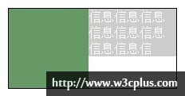
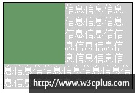

# BFC的理解与应用
## 什么是BFC(Block Formatting Contexts)
### w3c规定中的BFC定义
浮动元素和绝对定位元素，非块级盒子的块级容器(例如:inline-block,table-cell, table-caption),以及overflow值不为visible的块级盒子，都会为他们的内容创建新的BFC(块级格式上下文)

在BFC中，盒子从顶端开始垂直地一个接一个地排列，两个盒子之间的垂直的间隙是由他们的margin值所决定的。在一个BFC中，两个相邻的块级盒子的垂直外边距会产生折叠。

在BFC中，每一个盒子的左外边缘(margin-left)会触碰到容器的左边缘(border-left)(对于从右到左的格式来说，则触碰到右边缘)

### BFC的通俗理解:
首先BFC是一个名词，是一个独立的布局环境，我们可以理解为一个箱子(实际上是看不见摸不着的)，箱子里面物品的摆放是不受外界的影响的。转换为BFC的理解则是:BFC中的元素的布局是不受外界的影响(例如:我们往往利用这个特性来消除浮动元素对其非浮动的兄弟元素和其子元素带来的影响。)并且在一个BFC中，块盒与行盒(行盒由一行中所有的内联元素所组成)都会垂直的沿着其父元素的边框排列。

### 如何变成BFC
- float的值不为none
- overflow的值不为visible
- display的值为table-cell,table-caption,inline-block的任何一个
- position的值不为relative和static

### BFC的运用
在w3c的规范中，除了上面的一段定义之外，BFC的相关知识点分布地比较零散，但基本集中在float，绝对定位，margin collaspe中。下面我们来看看如何应用到BFC来解决问题。

在很多网站中，我们经常会看到这样的一种，左边图片+右边信息的两栏结构，下面我们来看看如何利用BFC来实现。

```html
<style>
.box{width:210px; border:1px solid #000; float : left;}
.img{width:100px;height:100px;background:#696;float:left;}
.info{background:#ccc;color:#fff;}
</style>
<div class="box">
  <div class="img">image</div>
  <p class="info">信息信息信息信息信息信息信息信息信息信息信息信</p>
</div>
```

一般情况下它呈现出我们所乐意看到的样子：  但随着文字信息增多后，会变地非常的糟糕：  很明显，这是因为info类里面的文字受到了浮动元素的影响，但这并不是我们所期望的。此时我们可以为P元素的内容建立一个BFC，让其内容消除对外界浮动元素的影响。根据上文所知，只要给info元素添加overflow:hidden;即可为其内容建立新的BFC。当然你也可以通过其他方法来建立。其效果如下： 

### 合并外边距与BFC
在CSS当中，相邻的两个盒子(可能是兄弟关系也可能是祖先关系)的外边距可以结合成一个单独的外边距。这种合并外边距的方式被称为折叠，并且因而所结合成的外边距称为折叠外边距。

#### 折叠的结果:
- 两个相邻的外边距都是正数时，折叠结果是他们两者之间较大的值。
- 两个相邻的外边距都是负数时，折叠结果是两者绝对值的较大值。
- 两个外边距一正一负时，折叠结果是两者的相加的和。

**产生折叠的必备条件：margin必须是邻接的!** 而根据w3c规范，两个margin是邻接的必须满足以下条件：
- 必须是处于常规文档流(非float和绝对定位)的块级盒子，并且处于同于一个BFC当中。
- 没有线盒，没有空隙(clearance，下面会讲到)，没有padding和border将他们分隔开
- 都属于垂直方向上相邻的外边距，可以是下面任意一种情况:
  - 元素的margin-top与其第一个常规文档流的子元素的margin-top(父元素与常规文档流第一个子元素相邻)
  - 元素的margin-bottom与其下一个常规文档流的兄弟元素的margin-top(兄弟元素之间的margin相邻)
  - height为auto的元素的margin-bottom与其最后一个常规文档流的子元素的margin-bottom(父元素与常规文档流最后子元素相邻)
  - 高度为0并且最小高度也为0，不包含常规文档流的子元素，并且自身没有建立新的BFC的元素的margin-top和margin-bottom(自身的margin相邻接)

#### 以上的条件意味着下列规则:
- 创建了新的BFC的元素(例如浮动元素或者'overflow值为'visible'以外的元素)与它的子元素的外边距不会折叠。
- 浮动元素不与任何元素外边距产生折叠(包括其父元素和子元素)(其实感觉上面说过了)
- 绝对定位元素不与任何元素外边距产生折叠
- inline-block元素不与任何元素的外边距产生折叠
- 一个常规文档流元素的margin-bottom与它下一个常规文档流的兄弟的margin-top会产生折叠，除非他们之间存在间隙(clearance).
- 一个常规文档流元素的margin-top与其第一个常规文档流的子元素的margin-top产生折叠，条件为父元素不包含padding和border，子元素不包含clearance。
- 一个height为auto并且min-height为0的常规文档流元素的margin-bottom会与其最后一个常规文档流子元素的margin-bottom折叠，条件为父元素不包含padding和border,子元素的margin-bottom不与包含clearance的margin-top折叠。
- 一个不包含border-top、border-bottom、padding-top、padding-bottom的常规文档流元素，并且其 'height' 为 0 或 'auto'， 'min-height' 为 '0'，其里面也不包含行盒(line box)，其自身的 margin-top 和 margin-bottom 会折叠。

### 下面我们对不产生折叠的情况逐一分析
#### 浮动和绝对定位不与任何元素产生margin折叠
原因：浮动元素和绝对定位元素不与其他盒子产生外边距折叠是因为 **元素会脱离当前的文档流，违反了上面所述的两个margin是邻接的条件同时，又因为浮动和绝对定位会使元素为它的内容创建新的BFC**，因此该元素和子元素所处的BFC是不相同的，因此也不会产生margin的折叠。

**Demo:**

```html
<style>
body{padding:0;margin:0;text-align: center;}
.wrapper{margin:30px;width:450px;border:1px solid red;}
.small-box{width:50px; height:50px;margin:10px;background: #9cc;}
.middle-box{width:100px;height: 100px;margin:20px;background: #99c;}
.big-box{width:120px;height: 120px;margin:20px;background: #33e;}
.floatL{float:left}
.floatR{float: right}
.clear{clear: both;}
.postA{position: absolute}
.overHid{overflow: hidden;}
.red{background: #f00;}
.green{background:#0f0;}
.blue{background: #00f;}
</style>
<div class="wrapper overHid">
  <div class="big-box blue">non-float</div>
  <div class="middle-box green floatL">
    <div class="small-box red"></div>
    float left
  </div>
</div>
```


